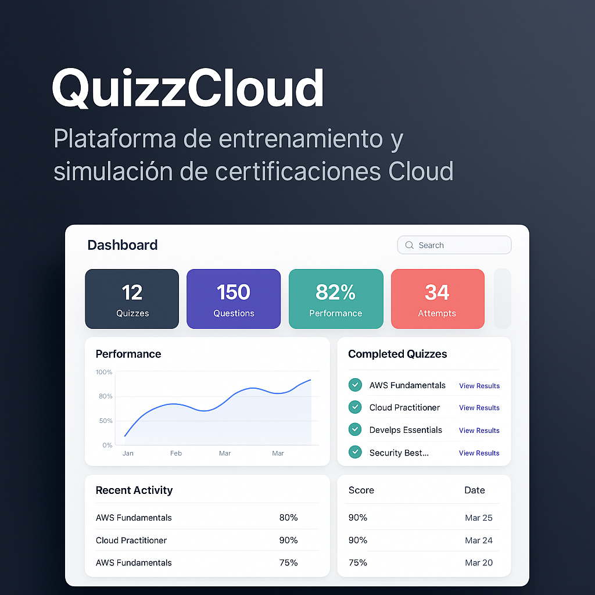

# 👋 Bienvenidos a la Organización Quizz (Factoria F5)

¡Hola! Si estás aquí, es porque te interesa formar parte del **proyecto QuizzCloud**, una plataforma enfocada en el **entrenamiento y análisis de exámenes de certificación** (inicialmente en AWS, pero con potencial para más tecnologías). Este README te ayudará a entender **en qué consiste el proyecto**, **cómo contribuir** y **qué esperamos de ti** como miembro de la comunidad de Factoria F5.

---

## 1. 🤔 ¿Qué es QuizzCloud?

**QuizzCloud** nació para ayudar a los alumnos de AWS Restart a prepararse mejor para las certificaciones en la nube, ofreciendo:
- **Simuladores de exámenes** con preguntas y escenarios cercanos a los oficiales.
- **Retroalimentación automática**, mostrando aciertos, errores y recomendaciones de mejora.
- **Estadísticas de progreso**, útiles para quienes estudian y para los formadores que guían el aprendizaje.

Con el tiempo, descubrimos que QuizzCloud puede usarse en otras certificaciones (Azure, GCP, seguridad en la nube, etc.), por lo que **queremos ampliarlo** para más cursos y estudiantes.

---

## 2. 🎯 ¿Por Qué es Importante este Proyecto?

1. **Formación Práctica Real**: Al ser un proyecto con usuarios activos, cualquier contribución impacta en el aprendizaje de otros compañeros.
2. **Experiencia Profesional**: Trabajamos con metodologías ágiles, revisiones de código (Pull Requests), CI/CD y despliegues en la nube. Esto te prepara para el mundo laboral.
3. **Innovación Social**: Factoria F5 promueve la diversidad e inclusión, abriendo oportunidades a perfiles que habitualmente quedan fuera del sector IT.

---

## 3. 🏗 Estructura de la Organización

Podrás encontrar varios repositorios principales:

- **quizz-frontend**: Código de la interfaz (React/Vue/Angular) y componentes visuales.
- **quizz-backend**: Lógica de servidor (Node.js/Python/Java) y conexiones de base de datos.
- **quizz-infra**: Scripts de despliegue (Docker, AWS, etc.) y configuraciones de CI/CD.
- **quizz-docs** (opcional): Documentación detallada, guías de estilo, ejemplos de configuración.

Revisa el canal de #quizz en Slack/Teams para confirmar cuál es el repositorio principal en tu caso.

---

## 4. 🚀 Cómo Contribuir

### 4.1. Requisitos Previos
- Manejar **Git y GitHub** para clonar repos, crear ramas y Pull Requests.
- Leer la **guía de estilo** (si existe) y la documentación principal (puede estar en quizz-docs o en la wiki del repo).
- Seguir las orientaciones de tu formador o Tech Lead, quien te asignará tareas o issues acordes a tu nivel.

### 4.2. Flujo de Contribución
1. **Haz un fork** (o clona el repo directamente si tienes permisos).
2. **Crea una rama** con el nombre de la tarea (ej.: `feature/add-user-login`).
3. **Desarrolla** la funcionalidad o la corrección siguiendo las convenciones de código.
4. **Pruebas**: Añade test unitarios o de integración (Jest, Cypress, etc.) cuando sea posible.
5. **Pull Request**: Sube tu rama, crea el PR y pide revisión a tu formador/Tech Lead.
6. **Feedback**: Ajusta según los comentarios que recibas.
7. **Merge**: Tras aprobarse el PR, se integra en la rama principal (main/dev).

### 4.3. Metodologías y Herramientas
- **Scrum/Kanban**: Usamos un tablero (Trello/Jira/Notion) para organizar tareas en sprints o columnas.
- **CI/CD**: Cada Pull Request se construye y prueba automáticamente (GitHub Actions, Jenkins, etc.).
- **Pruebas Automatizadas**: Añade test para asegurar la calidad del código.

---

## 5. 🌐 Roles y Contactos

- **Formador/Tech Lead**: Revisa tus Pull Requests, orienta tu aprendizaje y garantiza buenas prácticas de desarrollo.
- **Product Owner/Coordinador**: Define prioridades, evalúa necesidades y propone nuevas funcionalidades.
- **Alumnos Colaboradores**: Desarrollan y mejoran el código en backend/frontend, documentan y testean.
- **DevOps/Infra**: Mantienen los entornos de prueba/producción, supervisan el despliegue y la seguridad.

---

## 6. 💡 Fases de Colaboración

1. **Fase de Familiarización**: Instalación de dependencias, configuración local y lectura de documentación.
2. **Fase de Tareas Iniciales**: Resolver bugs sencillos o mejorar la documentación para familiarizarte con el código.
3. **Fase de Expansión**: Asumes *issues* más complejas, integras pruebas automatizadas y participas en despliegues a staging/producción.

---

## 7. 🤝 Buenas Prácticas y Valores

- **Trabajo en Equipo**: Respetar y apoyar a tus compañeros, especialmente en revisiones de código.
- **Diversidad e Inclusión**: Creemos en la igualdad de oportunidades, lenguaje inclusivo y empatía con todos los perfiles.
- **Aprendizaje Continuo**: Participar activamente y no temer al error; cada Pull Request es una oportunidad de crecimiento.
- **Calidad y Responsabilidad**: Este proyecto tiene usuarios reales, por lo que se busca un alto estándar de calidad en cada aporte.

---

## 8. 📌 Siguientes Pasos

1. **Clona o Forkea** el repositorio principal (quizz-backend, quizz-frontend, etc.) indicado por tu formador.
2. **Configura tu entorno** (instala dependencias, revisa la wiki y la documentación).
3. **Únete a las Reuniones Iniciales** o contacta a tu Tech Lead para recibir tus primeras tareas o issues.

---

## 9. 🙌 Reconocimientos

Este proyecto nació gracias a la colaboración de alumnos de AWS Restart y el equipo formativo de Factoria F5, quienes buscaron una herramienta más dinámica y útil para la preparación de exámenes en la nube. ¡Gracias por tu interés y por contribuir a que QuizzCloud sea un referente de formación e inclusión tecnológica!

---

## 10. 📝 Licencia y Uso

Revisa el archivo [LICENSE](./LICENSE) (si existe) para conocer los términos de uso o distribución. Si tienes dudas, contacta a tu formador o al coordinador del proyecto.

---

¡Gracias por sumarte al proyecto **QuizzCloud**!
**Tu aporte es valioso y puede impactar directamente** en el aprendizaje de otras personas y en tu propio desarrollo profesional.
